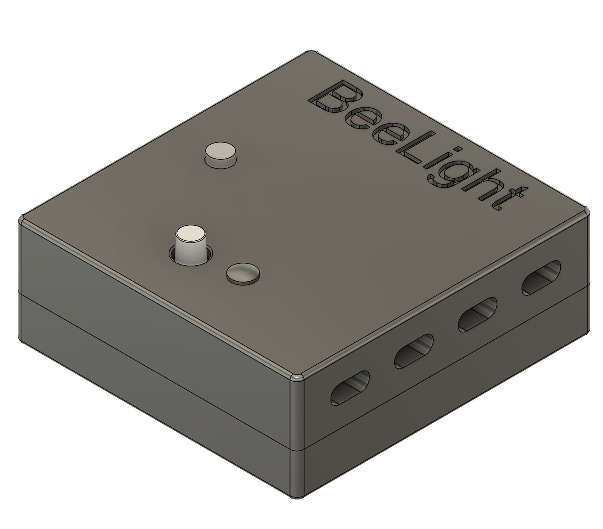
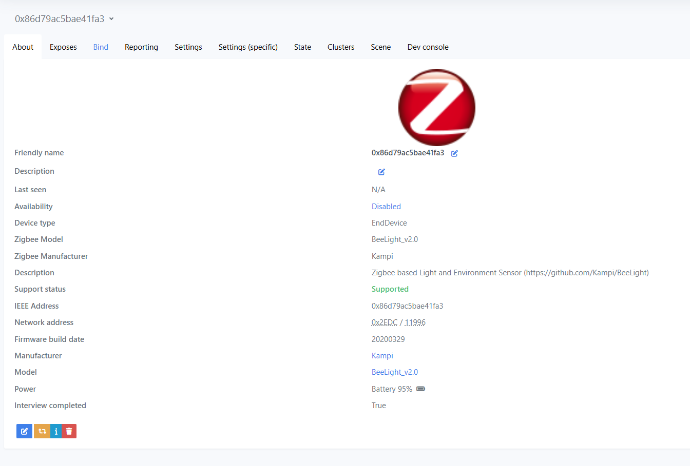
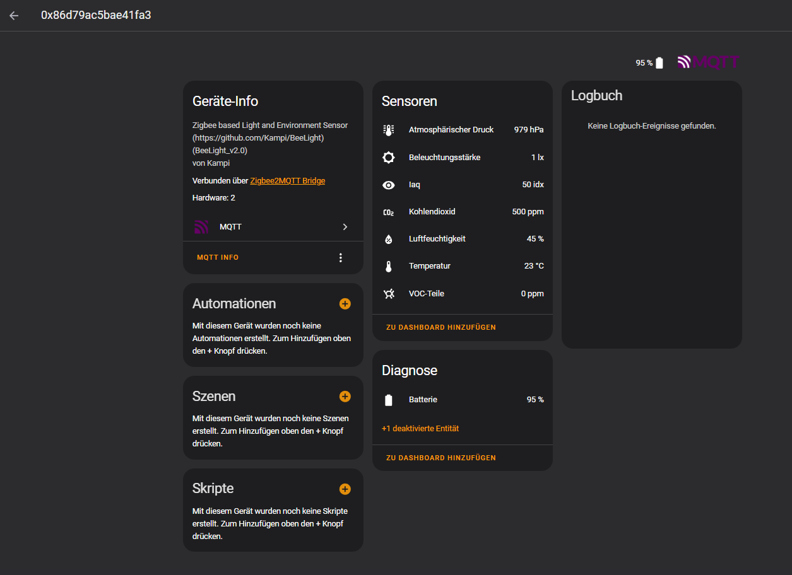

# BeeLight - Zigbee based light & environment sensor for Home Automation

[](https://opensource.org/license/gpl-3-0/)
[](https://www.github.com/Kampi/BeeLight/actions/workflows/pcb.yaml)
[](https://https://www.kampi.github.io/BeeLight/)

## Table of Contents

- [BeeLight - Zigbee based light \& environment sensor for Home Automation](#beelight---zigbee-based-light--environment-sensor-for-home-automation)
  - [Table of Contents](#table-of-contents)
  - [About](#about)
    - [Technical features](#technical-features)
  - [Before you start](#before-you-start)
    - [PCB](#pcb)
    - [Firmware](#firmware)
      - [Build the firmware](#build-the-firmware)
      - [Flash the firmware](#flash-the-firmware)
      - [Generate the production config for the device](#generate-the-production-config-for-the-device)
        - [Using west](#using-west)
        - [Using the command line](#using-the-command-line)
    - [Housing](#housing)
    - [Zigbee](#zigbee)
      - [Standard clusters](#standard-clusters)
      - [Custom cluster](#custom-cluster)
      - [Zigbee Dongle](#zigbee-dongle)
      - [Install the device to Zigbee2MQTT](#install-the-device-to-zigbee2mqtt)
      - [Using the NCS Zigbee Shell](#using-the-ncs-zigbee-shell)
  - [Directory structure](#directory-structure)
  - [Resources](#resources)
  - [Maintainer](#maintainer)

## About

Open-Source Zigbee-based light and environmental sensor with [Zigbee2MQTT](https://www.zigbee2mqtt.io/) support for your Home Automation (e.g., Home Assistant).



### Technical features

- Cutting-edge MCU with an nRF54L, running Zephyr
- Powered by a single coin cell
- Can measure
  - Temperature
  - Humidity
  - Pressure
  - IAQ
  - CO2 equivalent
  - VOC equivalent
  - Light intensity
  - Battery voltage
- Small housing (40x42x20 mm)
- Very basic electronic → Can be assembled by hand very easily
- Zigbee2MQTT compatibility


## Before you start

The project directory contains the hardware as a [KiCad 9](https://www.kicad.org/download/) project, the firmware and the Zigbee2MQTT configuration. You can check it out with Git:

```sh
git clone https://github.com/Kampi/BeeLight
cd BeeLight
git submodule update --init --recursive
cd firmware/app
west init -l .
west update
```

You also need [nrfutil](https://www.nordicsemi.com/Products/Development-tools/nRF-Util) and the `nrf5sdk-tools` to flash the production configuration to the sensor. First install `nrfutil` and then run the following command to install the SDK tools:

```sh
nrfutil install nrf5sdk-tools
```

### PCB

The project uses [Kibot](https://github.com/INTI-CMNB/KiBot) to automatically generate all required output data. After installing it you can execute the following command to run it:

```sh
cd hardware
./kibot-launch.sh
```

As an alternative you can run it via CI/CD in GitHub.

> **NOTE**
> You have to provide a Mouser API key with a variable called `MOUSER_KEY` to make use of the KiCost feature in the Kibot job.
>
> **NOTE**
> The programming connector is optional and can be left out or unsoldered after flashing the device.

### Firmware

#### Build the firmware

The firmware can be built with the following command:

```sh
cd firmware/app
west build --build-dir build . --pristine --board beelight@1/nrf54l15/cpuapp -- -DNCS_TOOLCHAIN_VERSION=NONE -DEXTRA_CONF_FILE=config/debug.conf -DBOARD_ROOT=.
```

You also need a Zigbee network to test and integrate the device. I use [Zigbee2MQTT](https://www.zigbee2mqtt.io/) running on a Raspberry Pi which allows me to connect my Zigbee network with my Home Automation.

> **NOTE**
> I do not support other Zigbee networks (like [ZHA](https://www.home-assistant.io/integrations/zha/)). The Zigbee standard allows you to connect the device with all other networks but I can't deliver a functional integration for these networks. You have to do it on your own!

#### Flash the firmware

After building the firmware you can run

```sh
west flash
```

to flash the firmware into the module.

> **NOTE**
> For some reason the current consumption stays high after flashing. I recommend a complete power cycle after flashing to make sure the device is consuming the lowest current possible.

#### Generate the production config for the device

##### Using west

You can run the command `west upload_config` to build and upload your configuration to the device automatically.

##### Using the command line

You must flash a production config to the device, before you can use it with Zigbee. You can either use the prebuilt config from the project or adjust it according to your needs.

```sh
nrfutil nrf5sdk-tools zigbee production_config zigbee_config.yml zigbee_config.hex --offset 0x17a000
nrfjprog --program zigbee_config.hex --verify
```

> **NOTE**
> The offset `0x17a000` is taken from the `PM_ZBOSS_PRODUCT_CONFIG_OFFSET` macro in `build/<app>/zephyr/include/generated/pm_config.h`. Also make sure to change `extended_address` in the Zigbee
> configuration file if you use more than one device!

### Housing

The housing is optimized for 3D printing and needs ~12 g of filament (PLA). You can find all the needed files in the `3d-printing` directory of this project.

### Zigbee

The device uses different standard and custom cluster to report the data to the network.

#### Standard clusters

| Cluster | ID |
| ------- | -- |
| Temperature | 0x0402 |
| Pressure | 0x0403 |
| Rel. Humidity | 0x0405 |
| Light | 0x0400 |

#### Custom cluster

The device uses three custom cluster to report `IAQ`, `VOC` and `CO2` to the network. Both clusters have three attributes for `value`, `min_value`, `max_value` and `tolerance`.

| Cluster | ID |
| ------- | -- |
| IAQ | 0x1A0A |
| VOC | 0x1A0B |
| CO2 | 0x1A0C |

| Attribute | ID |
| --------- | -- |
| Value | 0x0000 |
| Min. Value | 0x0001 |
| Max. Value | 0x0002 |
| Tolerance | 0x0003 |

#### Zigbee Dongle

Make sure to use a Zigbee 3 compatible dongle like [SONOFF ZBDongle-E](https://sonoff.tech/product/gateway-and-sensors/sonoff-zigbee-3-0-usb-dongle-plus-e/) and update the firmware to the latest version to prevent issues. You can follow [this](https://dongle.sonoff.tech/sonoff-dongle-flasher/) guide if you use a SONOFF dongle.

#### Install the device to Zigbee2MQTT

> **NOTE**
> Because it's not possible to use custom clusters with Zigbee2MQTT easily, you must adjust the application directly to use the sensor. Please take a look into the directory `z2m/data/external_converters/example` if you want to check how the modified files look like.

1. Download and install [Zigbee2MQTT](https://github.com/zigbee2mqtt/hassio-zigbee2mqtt)
2. Copy the external converter from `z2m/data_external_converters` to the `data` directory of your `Zigbee2MQTT` installation
3. Switch into the directory `.../zigbee2mqtt/node_modules/zigbee-herdsman-converters/converters`
4. Open the file `fromZigbee.js` and add the following code before `const converters = { ...converters1, ...converters2 };` at the end of the file

```js
const converters3 = {
  BeeLight_iaq: {
    cluster: 'msIAQ',
    type: ['attributeReport', 'readResponse'],
    convert: (model, msg, publish, options, meta) => {
      const iaq = msg.data['measuredValue'];
      const tolerance = msg.data['tolerance'];
      const property = (0, utils_1.postfixWithEndpointName)('iaq', msg, model, meta);
      return { [property]: iaq };
    },
  },
  BeeLight_voc: {
    cluster: 'msVOC',
    type: ['attributeReport', 'readResponse'],
    convert: (model, msg, publish, options, meta) => {
      const voc = msg.data['measuredValue'];
      const tolerance = msg.data['tolerance'];
      const property = (0, utils_1.postfixWithEndpointName)('voc', msg, model, meta);
      return { [property]: voc };
    },
  },
  BeeLight_co2: {
    cluster: 'msCO2',
    type: ['attributeReport', 'readResponse'],
    convert: (model, msg, publish, options, meta) => {
      const co2 = msg.data['measuredValue'];
      const tolerance = msg.data['tolerance'];
      const property = (0, utils_1.postfixWithEndpointName)('co2', msg, model, meta);
      return { [property]: co2 };
    },
  },
};
```

5. Change `const converters = { ...converters1, ...converters2 };` to `const converters = { ...converters1, ...converters2, ...converters3 };`
6. Save the file
7. Switch to `.../zigbee2mqtt/node_modules/zigbee-herdsman/dist/zspec/zcl/definition`
8. Open the file `cluster.js` and add the following cluster to the end of the list at the end of the file:

```js
      ...
    },
    msIAQ: {
        ID: 6666,
        attributes: {
            measuredValue: { ID: 0, type: enums_1.DataType.UINT16 },
            minMeasuredValue: { ID: 1, type: enums_1.DataType.UINT16 },
            maxMeasuredValue: { ID: 2, type: enums_1.DataType.UINT16 },
            tolerance: { ID: 3, type: enums_1.DataType.UINT8 },
        },
        commands: {},
        commandsResponse: {},
    },
    msVOC: {
        ID: 6667,
        attributes: {
            measuredValue: { ID: 0, type: enums_1.DataType.UINT16 },
            minMeasuredValue: { ID: 1, type: enums_1.DataType.UINT16 },
            maxMeasuredValue: { ID: 2, type: enums_1.DataType.UINT16 },
            tolerance: { ID: 3, type: enums_1.DataType.UINT8 },
        },
        commands: {},
        commandsResponse: {},
    },
    msCO2: {
        ID: 6668,
        attributes: {
            measuredValue: { ID: 0, type: enums_1.DataType.UINT32 },
            minMeasuredValue: { ID: 1, type: enums_1.DataType.UINT32 },
            maxMeasuredValue: { ID: 2, type: enums_1.DataType.UINT32 },
            tolerance: { ID: 3, type: enums_1.DataType.UINT8 },
        },
        commands: {},
        commandsResponse: {},
    },
};
```

9. Save the file
10. Restart Zigbee2MQTT

The device can now be connected to your Zigbee network and with this to your Home Assistant.




#### Using the NCS Zigbee Shell

You can test the device by using the NCS Zigbee Shell example and an nRF54DK or an nRF5340DK.

1. Flash the Zigbee Shell example to your board
2. Execute `nvram disable`
3. Execute `bdb role zc`
4. Execute `bdb channel 11`
5. Execute `bdb start`
6. Flash the sensor device firmware and the network configuration
7. Reset the sensor device and start the join procedure
8. You should get this output from the network coordinator device

```sh
[00:05:05.648,345] <inf> zigbee_app_utils: Joined network successfully (Extended PAN ID: f4ce36b2d4c06ca0, PAN ID: 0x6057)
[00:05:24.536,529] <inf> zigbee_app_utils: Device authorization event received (short: 0x02fa, long: 86d79ac5bae41fa3, authorization type: 3, authorization status: 0)
[00:05:24.536,773] <inf> zigbee_app_utils: Unimplemented signal (signal: 53, status: 0)
[00:05:24.537,139] <inf> zigbee_app_utils: Device update received (short: 0x02fa, long: 86d79ac5bae41fa3, status: 1)
```

9. Now you can read the clusters with `zcl attr read <Address> 10 <Cluster> 0x0104 0x0000`
10. Use `zcl subscribe on <Address> 10 <Cluster> 0x0104 0x00 33 <Min (s)> <Max (s)>` to create a binding for the given cluster

## Directory structure

- `3d-print`: All 3D print.related files
- `cad`: All relevant 3D models
- `docs`: All kinds of project documentation like schematics, BOM, etc.
  - `drawings`: 2D drawings for subcomponents, etc.
  - `images`: All documentation-relateBd images
- `hardware`: KiCad project for the PCB
- `firmware`: Zephyr project for the device firmware
- `prebuilt`: Prebuilt binaries
- `production`: Production files from the latest CI/CD run
- `z2m`: Zigbee2MQTT-related files

## Resources

- [Adding new Zigbee2MQTT devices](https://www.zigbee2mqtt.io/advanced/support-new-devices/01_support_new_devices.html)
- [Zigbee Cluster Library Specification](https://zigbeealliance.org/wp-content/uploads/2019/12/07-5123-06-zigbee-cluster-library-specification.pdf)
- [Generating HEX files for Zigbee production configuration](https://docs.nordicsemi.com/bundle/nrfutil/page/nrfutil-nrf5sdk-tools/guides/generating_zigbee_hex.html)
- [Zigbee Converters](https://github.com/Koenkk/zigbee-herdsman-converters)
- [KiBot Template](https://github.com/nguyen-v/KDT_Hierarchical_KiBot)
- [Zigbee Shell](https://docs.nordicsemi.com/bundle/addon-zigbee-r23-latest/page/lib/shell.html#zdo_ieeeaddr)

## Maintainer

- [Daniel Kampert](mailto:DanielKampert@kampis-elektroecke.de)
